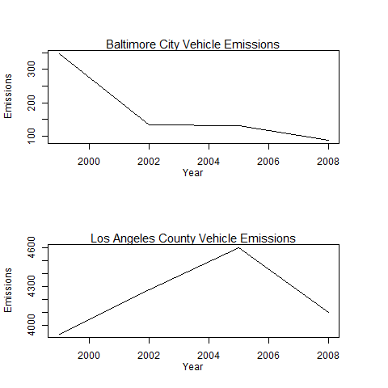

Fine particulate matter (PM2.5) is an ambient air pollutant for which there is strong evidence that it is harmful to human health. In the United States, the Environmental Protection Agency (EPA) is tasked with setting national ambient air quality standards for fine PM and for tracking the emissions of this pollutant into the atmosphere. Approximately every 3 years, the EPA releases its database on emissions of PM2.5. This database is known as the National Emissions Inventory (NEI). You can read more information about the NEI at the [EPA National Emissions Inventory web site](http://www.epa.gov/ttn/chief/eiinformation.html).

For each year and for each type of PM source, the NEI records how many tons of PM2.5 were emitted from that source over the course of the entire year. The data that you will use for this assignment are for 1999, 2002, 2005, and 2008.

### Data
The data for this project is available [in this zip file](https://d396qusza40orc.cloudfront.net/exdata/data/NEI_data.zip) (~30MB). Running any of the plots will download, extract, and load the data as necessary.

The zip file contains two files:

PM2.5 Emissions Data (summarySCC_PM25.rds): This file contains a data frame with all of the PM2.5 emissions data for 1999, 2002, 2005, and 2008. For each year, the table contains number of tons of PM2.5 emitted from a specific type of source for the entire year.
* fips: A five-digit number (represented as a string) indicating the U.S. county
* SCC: The name of the source as indicated by a digit string (see source code classification table)
* Pollutant: A string indicating the pollutant
* Emissions: Amount of PM2.5 emitted, in tons
* type: The type of source (point, non-point, on-road, or non-road)
* year: The year of emissions recorded

Source Classification Code Table (Source_Classification_Code.rds): This table provides a mapping from the SCC digit strings in the Emissions table to the actual name of the PM2.5 source. The sources are categorized in a few different ways from more general to more specific and you may choose to explore whatever categories you think are most useful. For example, source “10100101” is known as “Ext Comb /Electric Gen /Anthracite Coal /Pulverized Coal”.

### Assignment
The overall goal of this assignment is to explore the National Emissions Inventory database and see what it say about fine particulate matter pollution in the United states over the 10-year period 1999–2008.

1. Have total emissions from PM2.5 decreased in the United States from 1999 to 2008? Using the base plotting system, make a plot showing the total PM2.5 emission from all sources for each of the years 1999, 2002, 2005, and 2008.

Taking the sum of Emissions over the years and plotting the data shows emissions have decreased between 1999 and 2008

  

2. Have total emissions from PM2.5 decreased in the Baltimore City, Maryland (fips == "24510") from 1999 to 2008? Use the base plotting system to make a plot answering this question.

Taking the sum of Emissions over the years for Baltimore City, Maryland (fips == "24510"), we see that emissions decreased overall, but in 2005 increased from the 2002 levels and dropped back down in the 2008 levels.

  

3. Of the four types of sources indicated by the type (point, nonpoint, onroad, nonroad) variable, which of these four sources have seen decreases in emissions from 1999–2008 for Baltimore City? Which have seen increases in emissions from 1999–2008? Use the ggplot2 plotting system to make a plot answer this question.

Looking at Baltimore City, Maryland over the years by type we can see the following:

1. Overall the NON-ROAD, NONPOINT, and ON-ROAD types all decreased from 1999 to 2008.
2. The POINT type increased from 1999 to 2008.

  

4. Across the United States, how have emissions from coal combustion-related sources changed from 1999–2008?

Emissions from coal-related sources from 1999 to 2005 dropped slightly overall. From 2005 to 2008 a dramatic drop in emissions is seen.

5. How have emissions from motor vehicle sources changed from 1999–2008 in Baltimore City?

Emissions from all motor vehicles in Baltimore City have decreased each year from 1999 - 2008.

6. Compare emissions from motor vehicle sources in Baltimore City with emissions from motor vehicle sources in Los Angeles County, California (fips == "06037"). Which city has seen greater changes over time in motor vehicle emissions?

Baltimore City has seen the greatest decrease over time. Los Angeles County saw an increase from 1999 to 2005 and then a decrease in 2008, but overall an increase from 1999 to 2008.

