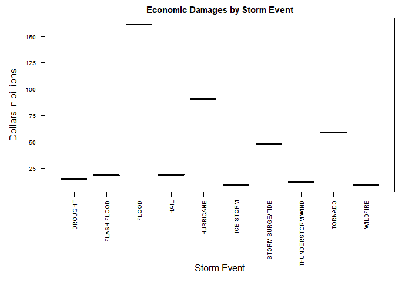
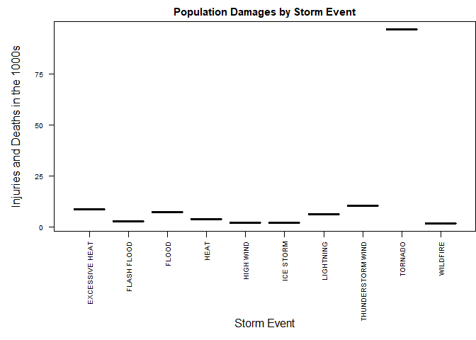

# Consequences of Severe Weather Events in the United States
Shay Harding  
May 19, 2017  


## Synopsis

Storms and other severe weather events can cause both public health and economic problems for communities and municipalities. Many severe events can result in fatalities, injuries, and property damage.

In this report we attempt to answer two important questions related to severe weather events in the United States between the years 1950 and 2011.

1. Across the United States, which types of events are most harmful with respect to population health?
2. Across the United States, which types of events have the greatest economic consequences?

To investigate these questions, we have obtained storm data from the U.S. National Oceanic and Atmospheric Administration (NOAA). Their database tracks characteristics of major storms and weather events in the United States, including when and where they occur, as well as estimates of any fatalities, injuries, and property damage.

The data reveals that floods, hurricanes, and tornadoes cause the most economic damage. The data also reveals that tornadoes, thunderstorm winds, and excessive heat cause the most injuries and deaths.

## Data Processing
If you wish to explore the data for this analysis, it can be retrieved  [online](https://d396qusza40orc.cloudfront.net/repdata/data/StormData.csv.bz2) (46.8 MB bzipped; 535 MB CSV; 902,297 obs. of 37 variables). The analysis code will download it as part of initial data processing. The file is saved to the current working directory:

**J:/OneDrive/Documents/GitHub/datasciencecoursera/reproducible-research/project-2**  

<div style="margin-top: 20px;">
#### Retrieve data

```r
url <- "https://d396qusza40orc.cloudfront.net/repdata/data/StormData.csv.bz2"
bz2file <- paste0(c(getwd(), "StormData.csv.bz2"), collapse="/")

if (!file.exists(bz2file)){
    download.file(url, bz2file)
}
```
</div>
<div style="margin-top: 20px;">
#### Read data
This can take some time so it's in a section by itself to keep it cached.


```r
storms <- read.csv(bz2file, stringsAsFactors=FALSE)
```
</div>
<div style="margin-top: 20px;">
#### Pre-process data
1. Remove columns we aren't using.
2. Clean up PROPDMGEXP and CROPDMGEXP according to [this analysis](https://rstudio-pubs-static.s3.amazonaws.com/58957_37b6723ee52b455990e149edde45e5b6.html)
3. Calculate PROPDMG as (PROPDMG * PROPDMGEXP) and remove PROPDMGEXP column.
4. Calculate CROPDMG as (CROPDMG * CROPDMGEXP) and remove CROPDMGEXP column.
5. Add PROPDMG and CROPDMG together to get a total in ALLDMG.
6. Add FATALITIES and INJURIES together to get a total in ALLPPL.
7. Remove CROPDMG\*, PROPDMG\*, FATALITIES, and INJURIES columns as they are no longer needed.
8. Remove rows where ALLDMG and ALLPPL equal zero.
9. Clean up EVTYPE data. If there are multiple events mentioned, we give precendence to the first event with the thinking that the first event is the most damaging.
10. Remove EVTYPE data that is of no use by having completely incorrect values.


```r
storms <- storms[, !(names(storms) %in% c("TIME_ZONE", "COUNTY", "COUNTYNAME", "BGN_RANGE", "BGN_AZI", "BGN_LOCATI", "COUNTY_END", "COUNTYENDN", "END_RANGE", "END_AZI", "END_LOCATI", "LENGTH", "WIDTH", "WFO", "ZONENAMES", "LATITUDE", "LATITUDE_E", "LONGITUDE", "LONGITUDE_", "REMARKS", "BGN_TIME", "END_DATE", "END_TIME", "STATEOFFIC", "REFNUM", "F", "STATE__", "MAG", "STATE", "BGN_DATE"))]

## Change numeric PROPDMGEXP and CROPDMGEXP to 10
exps = c("0", "1", "2", "3", "4", "5", "6", "7", "8")
storms <- within(storms, PROPDMGEXP[PROPDMGEXP %in% exps] <- 10)
storms <- within(storms, CROPDMGEXP[CROPDMGEXP %in% exps] <- 10)

## PROPDMGEXP of "+" is a multiplier of 1
storms <- within(storms, PROPDMGEXP[PROPDMGEXP == "+"] <- 1)

## Clear damange and exp where exp == "-"
storms <- within(storms, PROPDMG[PROPDMGEXP == "-"] <- PROPDMGEXP[PROPDMGEXP == "-"] <- 0)
storms <- within(storms, CROPDMG[CROPDMGEXP == "-"] <- CROPDMGEXP[CROPDMGEXP == "-"] <- 0)

## All of these have PROPDMG == 0 so set PROPDMGEXP == 0
storms <- within(storms, PROPDMGEXP[PROPDMGEXP == "?"] <- 0)
storms <- within(storms, PROPDMGEXP[PROPDMGEXP == ""] <- 0)

## All of these have CROPDMG == 0 so set CROPDMGEXP == 0
storms <- within(storms, CROPDMGEXP[CROPDMGEXP == "?"] <- 0)
storms <- within(storms, CROPDMGEXP[CROPDMGEXP == ""] <- 0)

## Force other exps to one case
storms$PROPDMGEXP <- toupper(storms$PROPDMGEXP)
storms$CROPDMGEXP <- toupper(storms$CROPDMGEXP)

## Convert to numberic exp
storms <- within(storms, CROPDMGEXP[CROPDMGEXP == "H"] <- 100)
storms <- within(storms, PROPDMGEXP[PROPDMGEXP == "H"] <- 100)

storms <- within(storms, CROPDMGEXP[CROPDMGEXP == "K"] <- 1000)
storms <- within(storms, PROPDMGEXP[PROPDMGEXP == "K"] <- 1000)

storms <- within(storms, CROPDMGEXP[CROPDMGEXP == "M"] <- 1000000)
storms <- within(storms, PROPDMGEXP[PROPDMGEXP == "M"] <- 1000000)

storms <- within(storms, CROPDMGEXP[CROPDMGEXP == "B"] <- 1000000000)
storms <- within(storms, PROPDMGEXP[PROPDMGEXP == "B"] <- 1000000000)

## Convert damage columns to full dollar amounts
storms$PROPDMG <- as.numeric(storms$PROPDMG) * as.numeric(storms$PROPDMGEXP)
storms$CROPDMG <- as.numeric(storms$CROPDMG) * as.numeric(storms$CROPDMGEXP)

## Add PROPDMG and CROPDMG
storms$ALLDMG <- storms$PROPDMG + storms$CROPDMG

## Keep it simple and add FATALITIES and INJURIES
storms$ALLPPL <- storms$FATALITIES + storms$INJURIES

## No longer need these columns
storms <- storms[, !(names(storms) %in% c("PROPDMGEXP", "CROPDMGEXP", "PROPDMG", "CROPDMG", "FATALITIES", "INJURIES"))]

## Rows with no fatalities, injuries, or damage are not needed for this analysis
storms <- storms[!(storms$ALLPPL == 0 & storms$ALLDMG == 0),]

## Convert EVTYPE to upper case and remove trailing/leading whitespace
storms$EVTYPE <- trimws(toupper(storms$EVTYPE))

## General clean up of event data
storms$EVTYPE <- gsub("\\W+$", "", storms$EVTYPE, perl = TRUE)

## Treat anything with "waterspout" as waterspout since these are essentially tornadoes over water
storms$EVTYPE <- gsub(".*WATERSPOUT.*", "WATERSPOUT", storms$EVTYPE, perl = TRUE)

storms$EVTYPE <- gsub(".*RIP.*", "RIP CURRENT", storms$EVTYPE, perl = TRUE)
storms$EVTYPE <- gsub(".*(SURF|WAVES).*", "HIGH SURF", storms$EVTYPE, perl = TRUE)
storms$EVTYPE <- gsub(".*AVALANCH?E.*", "AVALANCHE", storms$EVTYPE, perl = TRUE)
storms$EVTYPE <- gsub("FOG", "DENSE FOG", storms$EVTYPE, perl = TRUE)
storms$EVTYPE <- gsub(".*HURRICANE.*", "HURRICANE", storms$EVTYPE, perl = TRUE)
storms$EVTYPE <- gsub("TYPHOON", "HURRICANE", storms$EVTYPE, perl = TRUE)
storms$EVTYPE <- gsub("DAM BREAK", "SEICHE", storms$EVTYPE, perl = TRUE)
storms$EVTYPE <- gsub("^LAKE[\\s-]EFFECT.*SNOW.*", "LAKE-EFFECT SNOW", storms$EVTYPE, perl = TRUE)

## There's only one type of fire event
storms$EVTYPE <- gsub(".*FIRE.*", "WILDFIRE", storms$EVTYPE, perl = TRUE)

## Heavy snow + wind == blizzard
storms$EVTYPE <- gsub(".*HEAVY SNOW.*WIND.*", "BLIZZARD", storms$EVTYPE, perl = TRUE)
## Treat others as "HEAVY SNOW"
storms$EVTYPE <- gsub(".*(?<!LAKE-EFFECT )SNOW.*", "HEAVY SNOW", storms$EVTYPE, perl = TRUE)
## Anything else with BLIZZARD, treat as BLIZZARD
storms$EVTYPE <- gsub(".*BLIZZARD.*", "BLIZZARD", storms$EVTYPE, perl = TRUE)

## Clean up floods and rain
storms$EVTYPE <- gsub("^(FLASH|RAPIDLY RISING).*", "FLASH FLOOD", storms$EVTYPE, perl = TRUE)
storms$EVTYPE <- gsub("^FLOOD.*", "FLOOD", storms$EVTYPE, perl = TRUE)
storms$EVTYPE <- gsub("HIGH WATER", "FLOOD", storms$EVTYPE, perl = TRUE)
storms$EVTYPE <- gsub(".*URBAN.*", "FLOOD", storms$EVTYPE, perl = TRUE)
storms$EVTYPE <- gsub("^(COASTAL|TIDAL).*", "COASTAL FLOOD", storms$EVTYPE, perl = TRUE)
storms$EVTYPE <- gsub(".*CSTL.*", "COASTAL FLOOD", storms$EVTYPE, perl = TRUE)
storms$EVTYPE <- gsub("^HEAVY.*(RAIN|SHOWER).*", "HEAVY RAIN", storms$EVTYPE, perl = TRUE)
storms$EVTYPE <- gsub("^(SEVERE )?(TH?UN?D?EE?R|TSTM).*", "THUNDERSTORM WIND", storms$EVTYPE, perl = TRUE)
storms$EVTYPE <- gsub(".*WIND.*RAIN.*", "THUNDERSTORM WIND", storms$EVTYPE, perl = TRUE)
storms$EVTYPE <- gsub(".*STORM FORCE WIND.*", "THUNDERSTORM WIND", storms$EVTYPE, perl = TRUE)
storms$EVTYPE <- gsub(".*RAIN.*WIND.*", "THUNDERSTORM WIND", storms$EVTYPE, perl = TRUE)
storms$EVTYPE <- gsub(".*RAIN.*", "HEAVY RAIN", storms$EVTYPE, perl = TRUE)
storms$EVTYPE <- gsub("(?<!COASTAL|FLASH) FLOOD.*", "FLOOD", storms$EVTYPE, perl = TRUE)
storms$EVTYPE <- gsub(".*\\wFLOOD.*", "FLOOD", storms$EVTYPE, perl = TRUE)
storms$EVTYPE <- gsub(".*(FREEZING\\s+RAIN|SLEET).*", "SLEET", storms$EVTYPE, perl = TRUE)
storms$EVTYPE <- gsub(".*ICE STORM.*", "ICE STORM", storms$EVTYPE, perl = TRUE)
storms$EVTYPE <- gsub(".*ICE(?! STORM).*", "FROST/FREEZE", storms$EVTYPE, perl = TRUE)
storms$EVTYPE <- gsub(".*(FROST|FREEZE|GLAZE|ICY).*", "FROST/FREEZE", storms$EVTYPE, perl = TRUE)
storms$EVTYPE <- gsub(".*(FLOE|SLIDE|SLUMP).*", "DEBRIS FLOW", storms$EVTYPE, perl = TRUE)
storms$EVTYPE <- gsub(".*(PRECIP|DOWNBURST).*", "HEAVY RAIN", storms$EVTYPE, perl = TRUE)

## Clean up storms and wind
storms$EVTYPE <- gsub(".*TROPICAL STORM.*", "TROPICAL STORM", storms$EVTYPE, perl = TRUE)
storms$EVTYPE <- gsub(".*(TOR|GUST)N[AD]+O.*", "TORNADO", storms$EVTYPE, perl = TRUE)
storms$EVTYPE <- gsub(".*LANDSPOUT.*", "TORNADO", storms$EVTYPE, perl = TRUE)
storms$EVTYPE <- gsub("^WIND.*", "HIGH WIND", storms$EVTYPE, perl = TRUE)
storms$EVTYPE <- gsub(".*/HIGH\\s+WIND.*", "HIGH WIND", storms$EVTYPE, perl = TRUE)
storms$EVTYPE <- gsub("^(STRONG WIND|WHIRLWIND).*", "STRONG WIND", storms$EVTYPE, perl = TRUE)
storms$EVTYPE <- gsub(".*/STRONG\\s+WIND.*", "STRONG WIND", storms$EVTYPE, perl = TRUE)
storms$EVTYPE <- gsub(".*(?<!LOW )(SEA(?!SON)|TIDE|SURGE|SWELL).*", "STORM SURGE/TIDE", storms$EVTYPE, perl = TRUE)
storms$EVTYPE <- gsub("^(HIGH|GUSTY|GRADIENT)\\s+WIND.*", "HIGH WIND", storms$EVTYPE, perl = TRUE)
storms$EVTYPE <- gsub("^DUST STORM|BLOWING DUST", "DUST STORM", storms$EVTYPE, perl = TRUE)
storms$EVTYPE <- gsub(".*TURBULENCE.*", "STRONG WIND", storms$EVTYPE, perl = TRUE)
storms$EVTYPE <- gsub(".*(WINTER WEATHER|WINTRY MIX).*", "WINTER WEATHER", storms$EVTYPE, perl = TRUE)
storms$EVTYPE <- gsub(".*WINTER STORM.*", "WINTER STORM", storms$EVTYPE, perl = TRUE)
storms$EVTYPE <- gsub(".*WIND.*CHILL.*", "EXTREME COLD/WIND CHILL", storms$EVTYPE, perl = TRUE)
storms$EVTYPE <- gsub(".*LIGHTN?ING.*", "LIGHTNING", storms$EVTYPE, perl = TRUE)
storms$EVTYPE <- gsub("^(DRY )?MI[CR]+OBURST( WIND.*)?", "HIGH WIND", storms$EVTYPE, perl = TRUE)
storms$EVTYPE <- gsub("WET MI[CR]+OBURST", "HEAVY RAIN", storms$EVTYPE, perl = TRUE)
storms$EVTYPE <- gsub("^DUST STORM.*", "DUST STORM", storms$EVTYPE, perl = TRUE)
storms$EVTYPE <- gsub("MARINE TSTM WIND", "MARINE THUNDERSTORM WIND", storms$EVTYPE, perl = TRUE)
storms$EVTYPE <- gsub(".*NON.*WIND.*", "HIGH WIND", storms$EVTYPE, perl = TRUE)
storms$EVTYPE <- gsub("^(SMALL )?HAIL.*", "HAIL", storms$EVTYPE, perl = TRUE)


## Clean up heat and cold events
storms$EVTYPE <- gsub(".*DROUGHT.*", "DROUGHT", storms$EVTYPE, perl = TRUE)
storms$EVTYPE <- gsub(".*(EXCESSIVE|EXTREME|RECORD).*HEAT.*", "EXCESSIVE HEAT", storms$EVTYPE, perl = TRUE)
storms$EVTYPE <- gsub("^HEAT .*", "HEAT", storms$EVTYPE, perl = TRUE)
storms$EVTYPE <- gsub(".*WARM.*", "HEAT", storms$EVTYPE, perl = TRUE)
storms$EVTYPE <- gsub(".*(EXCESSIVE|EXTREME|RECORD).*COLD.*", "EXTREME COLD/WIND CHILL", storms$EVTYPE, perl = TRUE)
storms$EVTYPE <- gsub(".*HYPOTHERMIA.*", "EXTREME COLD/WIND CHILL", storms$EVTYPE, perl = TRUE)
storms$EVTYPE <- gsub(".*(?<!EXTREME )COLD.*", "COLD/WIND CHILL", storms$EVTYPE, perl = TRUE)
storms$EVTYPE <- gsub(".*LOW TEMP.*", "COLD/WIND CHILL", storms$EVTYPE, perl = TRUE)

## Rows with missing data we can't use
storms <- storms[!(storms$EVTYPE == "" | storms$EVTYPE == "APACHE COUNTY" | storms$EVTYPE == "OTHER" | storms$EVTYPE == "HIGH" | storms$EVTYPE == "COOL AND WET"),]

print(paste0(c(nrow(storms), "obs. of", ncol(storms), "variables"), collapse=" "))
```

```
## [1] "254525 obs. of 3 variables"
```
</div>


## Results
In order to capture economic damages, the property and crop damages were added together. In order to capture poplution damages, the injuries and fatalities were added together. The top 10 items from each list are plotted below to give the results.


#### Economic Damages
Upon plotting the top 10 most damaging storm events, the data reveals that floods cause the most economic damage, followed by hurricanes and tornadoes.


```r
damages <- aggregate(ALLDMG ~ EVTYPE, storms, sum)
damages_sorted <- head(damages[order(-damages$ALLDMG),], n=10)
damages_sorted$ALLDMG <- damages_sorted$ALLDMG/1000000000

par(mar=c(10, 5, 2, 0), cex=.80, cex.axis=.80)
plot(as.factor(damages_sorted$EVTYPE), damages_sorted$ALLDMG, yaxt="n", las=2)
axis(side=2, at=seq(from=0, to=max(damages_sorted$ALLDMG), by=25), las=1)
mtext("Storm Event", side=1, line=8)
mtext("Dollars in billions", side=2, line=3)
title(main="Economic Damages by Storm Event")
```

<!-- -->

#### Population Damages
Upon plotting the top 10 events that cause the most fatalities and injuries, the data reveals that tornadoes, followed by thunderstorm winds and excessive heat rise to the top. Floods, which cause the most economic damage come in fourth for injuries and deaths.


```r
fis <- aggregate(ALLPPL ~ EVTYPE, storms, sum)
fis_sorted <- head(fis[order(-fis$ALLPPL),], n=10)
fis_sorted$ALLPPL <- fis_sorted$ALLPPL/1000

par(mar=c(10, 5, 2, 0), cex=.80, cex.axis=.80)
plot(as.factor(fis_sorted$EVTYPE), fis_sorted$ALLPPL, yaxt="n", las=2)
axis(side=2, at=seq(from=0, to=max(fis_sorted$ALLPPL), by=25), las=1)
mtext("Storm Event", side=1, line=8)
mtext("Injuries and Deaths in the 1000s", side=2, line=3)
title(main="Population Damages by Storm Event")
```

<!-- -->
